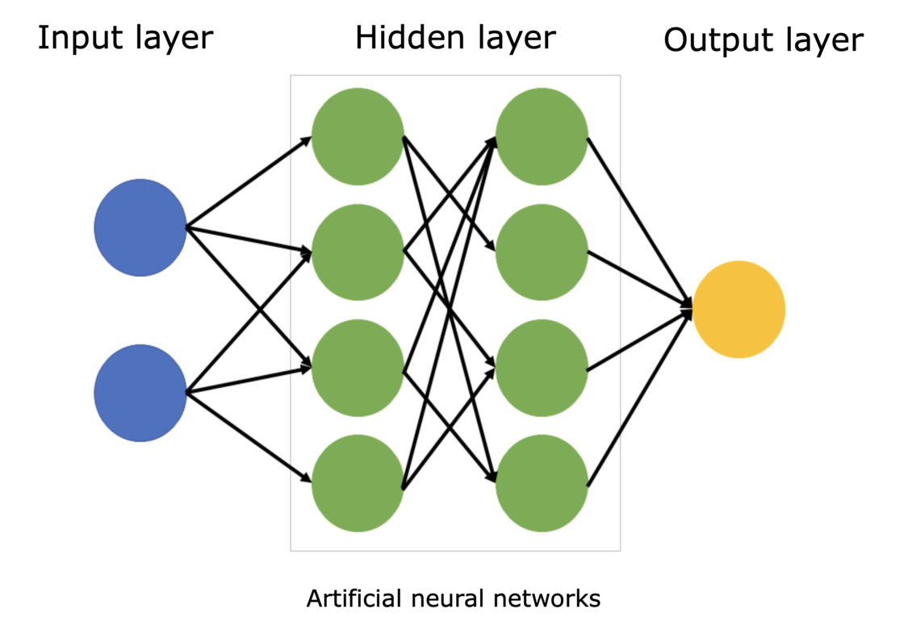

# Deep Learning Fundamentals

The field of *deep learning* is inspired by the structure and functions of our brain, specifically it is called *neural networks* that mimics how our human brain processes information.

## Neural networks

The core of deep learning is neural network. Just like our brain have neurons that are connected to each other, the neural network have tiny units called *nodes*. The nodes are organized into layers. An input layer, one or more hidden layer, and an output layer.

Neural network image

