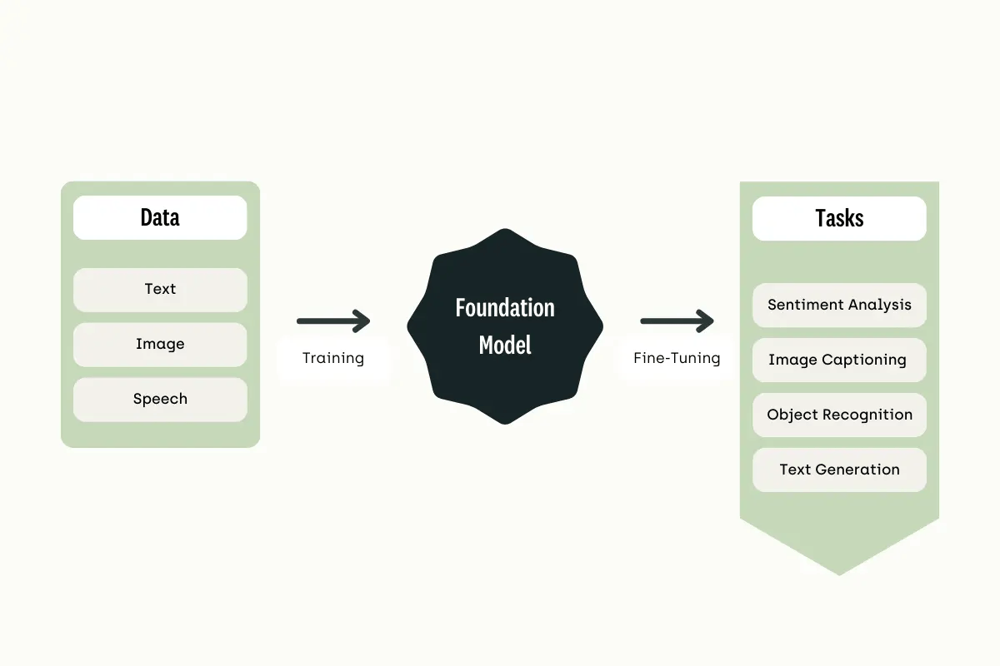

# Generative AI Fundamentals

Machine Learning has been around for many decades which leads you to a question about what led to the emergence of *Generative AI*? The answer is simple and straightforward. Companies are willing to invest more in computing resources and hiring large team that is willing to invest in generating and implementing new ideas. This are all contributors to the emergence of Generative AI.

## Foundational Model

*Foundational Model* serves as a foundation or engine to empower Generative AI. Foundational Models are pre-trained on massive amount of data to perform multiple task such as text generation/summarization, information extraction, image generation, chatbot, and question answering. This is useful because compared to traditional ML Model that you train multiple models for different task, Foundational Model can perform this multiple task in a single unified model.

## FM Lifecycle

The FM Lifecycle covers multiple stages or steps on developing reliable foundational model that empowers almost all Generative AI today.